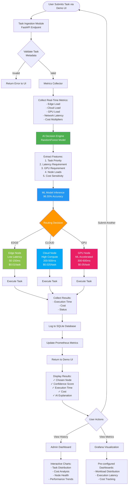
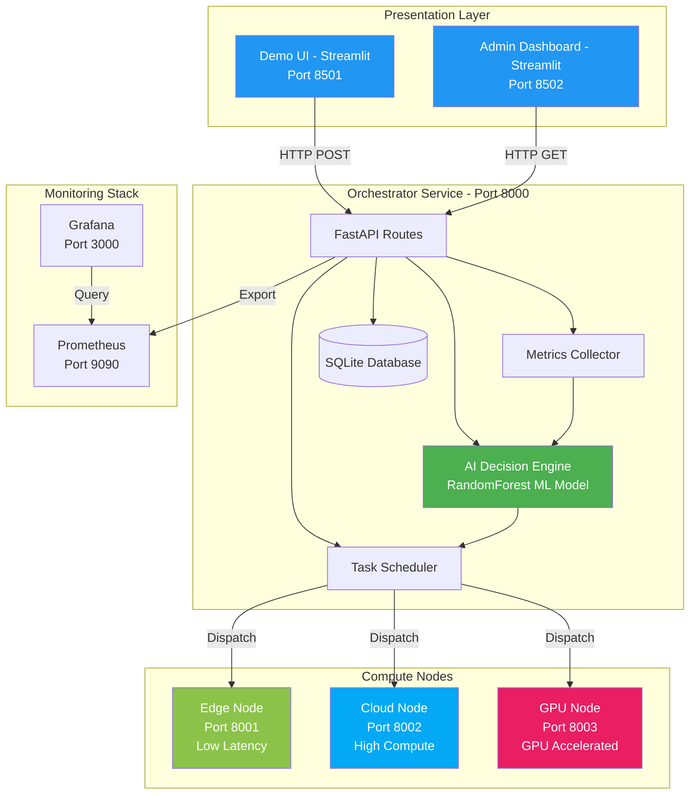
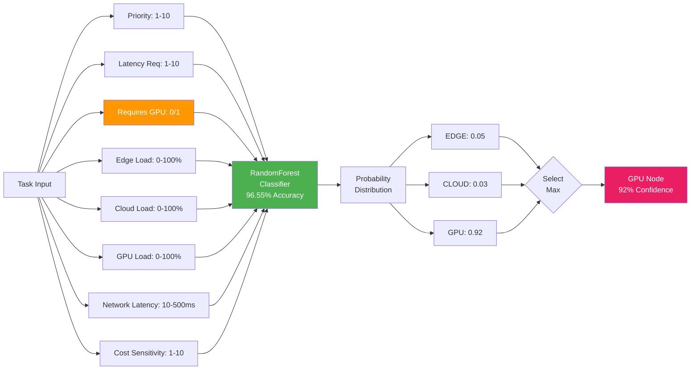
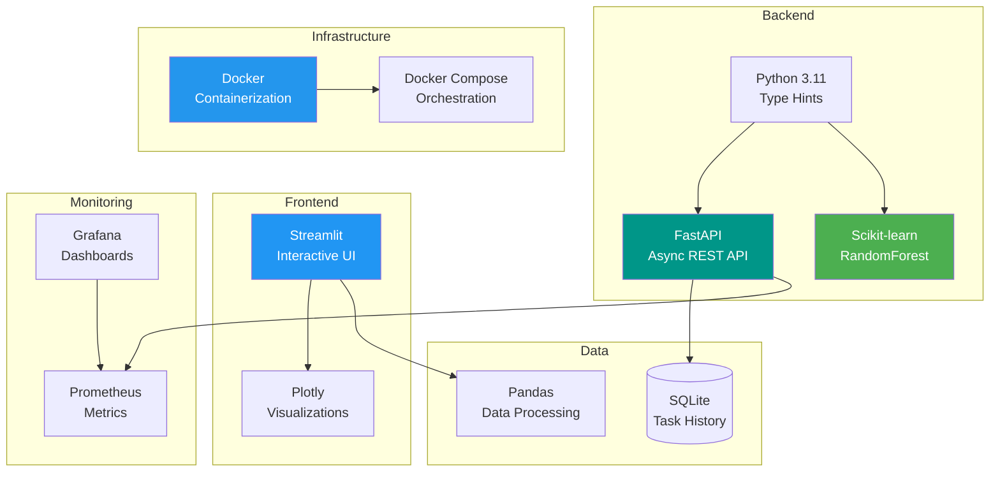
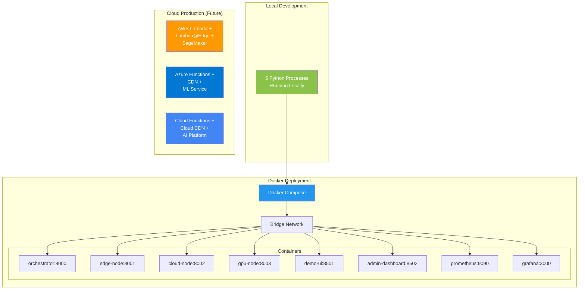

# AI Workload Orchestrator - System Architecture

## System Flow Diagram

## Component Architecture

## ML Model Decision Flow

## Technology Stack

## Deployment Architecture

## Key Features Highlighted

### ✅ Real-Time Workload Analysis
- Dynamic metrics collection every request
- ML-based decision making (<10ms inference)
- Adaptive load balancing

### ✅ Automated Resource Allocation
- Zero manual intervention required
- Intelligent routing based on 8 features
- 96.55% routing accuracy

### ✅ Performance Monitoring
- Prometheus metrics export
- Grafana visualization dashboards
- SQLite persistent logging
- Real-time admin dashboard

### ✅ Cost Optimization
- Per-task cost tracking
- Cost-aware routing decisions
- Total cost analytics

### ✅ Industry Applications
- **Finance**: Fraud detection (Edge - low latency)
- **Healthcare**: Medical imaging (GPU - ML acceleration)
- **Logistics**: Route optimization (Cloud - batch processing)
- **Manufacturing**: IoT sensor processing (Edge - real-time)
