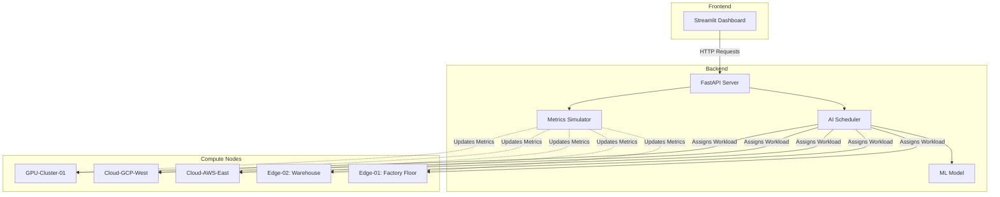

# AI-Powered Workload Orchestrator

A prototype AI-powered orchestration tool that dynamically assesses and allocates workloads across edge, cloud, and GPU environments. This system automates task routing based on real-time metrics including latency, connectivity, urgency, and cost.

## 🎯 Project Overview

This orchestrator reduces manual intervention in hybrid compute environments by intelligently routing workloads to the most appropriate compute resource, improving resource utilization and demonstrating enhanced agility and efficiency.

## ✨ Features

- **Dynamic Workload Scheduling**: AI-powered decision engine that considers multiple factors (CPU, RAM, latency, cost, GPU requirements)
- **Multi-Environment Support**: Manages workloads across Edge, Cloud, and GPU compute nodes
- **Real-Time Metrics Simulation**: Simulates dynamic resource metrics (CPU usage, latency, power consumption, cost)
- **Interactive Dashboard**: Streamlit-based UI for monitoring cluster state and submitting workloads
- **RESTful API**: FastAPI backend with comprehensive endpoints for orchestration control
- **Machine Learning Integration**: Pre-trained model for intelligent scheduling decisions
- **Containerized Deployment**: Docker Compose setup for easy deployment

## 🏗️ Architecture



### Component Breakdown

| Component | Technology | Purpose |
|-----------|-----------|---------|
| **Backend API** | FastAPI | RESTful API for orchestration control |
| **Scheduler** | Python + scikit-learn | AI-powered workload assignment logic |
| **Simulator** | AsyncIO | Real-time metrics simulation |
| **Frontend** | Streamlit | Interactive dashboard and monitoring |
| **ML Model** | Random Forest | Trained model for scheduling decisions |
| **Infrastructure** | Docker Compose | Containerized multi-service deployment |

## 🚀 Quick Start

### Prerequisites

- Docker and Docker Compose installed
- Python 3.9+ (for local development)
- 2GB free RAM minimum

### Installation & Running

1. **Clone or navigate to the project directory**:
   ```bash
   cd ai_orchestrator
   ```

2. **Start the application using Docker Compose**:
   ```bash
   docker-compose up --build
   ```

3. **Access the services**:
   - **Frontend Dashboard**: [http://localhost:8501](http://localhost:8501)
   - **Backend API**: [http://localhost:8000](http://localhost:8000)
   - **API Documentation**: [http://localhost:8000/docs](http://localhost:8000/docs)

### Running Locally (Without Docker)

1. **Install dependencies**:
   ```bash
   pip install -r requirements.txt
   ```

2. **Start the Backend**:
   ```bash
   cd backend
   uvicorn main:app --reload --port 8000
   ```

3. **Start the Frontend** (in a new terminal):
   ```bash
   cd frontend
   streamlit run app.py --server.port 8501
   ```

## 📊 Usage Guide

### Dashboard Features

#### 1. **Cluster Overview** (Dashboard Page)
- View all compute nodes with real-time metrics
- Monitor CPU usage, RAM, latency, and cost per hour
- Visualize resource utilization with interactive charts
- Track workload assignments

#### 2. **Submit Workload** (Submit Task Page)
- Define task parameters:
  - **Task Name**: Identifier for the workload
  - **Priority**: low, medium, high, or critical
  - **CPU/RAM Requirements**: Resource needs
  - **Max Latency**: Maximum acceptable latency (ms)
  - **GPU Requirement**: Whether the task needs GPU

The AI scheduler will automatically assign the workload to the most suitable node.

### Example Workload Submission

Via the UI:
1. Navigate to **Submit Task** page
2. Fill in the form:
   - Task Name: `Image-Processing-Job`
   - Priority: `high`
   - CPU: 8 cores
   - RAM: 16 GB
   - GPU: ✓ (checked)
3. Click **Submit Workload**

Via API (using curl):
```bash
curl -X POST "http://localhost:8000/workloads" \
  -H "Content-Type: application/json" \
  -d '{
    "name": "Image-Processing-Job",
    "priority": "high",
    "required_cpu": 8,
    "required_ram": 16,
    "requires_gpu": true,
    "max_latency_ms": 50
  }'
```

## 🔌 API Reference

### Endpoints

| Method | Endpoint | Description |
|--------|----------|-------------|
| `GET` | `/` | Health check |
| `GET` | `/nodes` | List all compute nodes with metrics |
| `GET` | `/workloads` | List all submitted workloads |
| `POST` | `/workloads` | Submit a new workload |
| `GET` | `/cluster/state` | Get complete cluster state |

### Sample API Response

**GET /nodes**:
```json
[
  {
    "id": "uuid-string",
    "name": "Edge-01",
    "type": "edge",
    "status": "active",
    "location": "Factory Floor",
    "max_cpu": 4,
    "max_ram": 8,
    "metrics": {
      "cpu_usage": 45.2,
      "ram_usage": 60.1,
      "latency_ms": 5,
      "power_consumption": 120,
      "cost_per_hour": 0.05
    }
  }
]
```

**POST /workloads** Request:
```json
{
  "name": "Data-Analysis-Task",
  "priority": "medium",
  "required_cpu": 4,
  "required_ram": 8,
  "requires_gpu": false,
  "max_latency_ms": 100
}
```

**POST /workloads** Response:
```json
{
  "id": "workload-uuid",
  "name": "Data-Analysis-Task",
  "priority": "medium",
  "required_cpu": 4,
  "required_ram": 8,
  "requires_gpu": false,
  "max_latency_ms": 100,
  "status": "assigned",
  "assigned_node_id": "edge-node-uuid",
  "submitted_at": "2025-12-03T14:30:00Z"
}
```

## 🧠 AI Scheduling Logic

The scheduler uses a multi-factor decision algorithm:

1. **Filtering**: Eliminates nodes that don't meet requirements:
   - CPU/RAM capacity
   - GPU availability (if required)
   - Latency constraints
   - Node status (must be active)

2. **Scoring**: Ranks viable nodes using:
   - Resource availability (weight: 0.3)
   - Latency performance (weight: 0.25)
   - Cost efficiency (weight: 0.25)
   - Priority matching (weight: 0.2)

3. **ML Enhancement**: Uses Random Forest model trained on historical patterns

4. **Selection**: Assigns workload to highest-scoring node

## 🧪 Testing

Run the test suite:

```bash
python -m pytest tests/test_flow.py -v
```

The test suite covers:
- Node initialization
- Workload submission
- Scheduling logic
- API endpoints
- Metrics simulation

## 📁 Project Structure

```
ai_orchestrator/
├── backend/
│   ├── Dockerfile              # Backend container definition
│   ├── main.py                 # FastAPI application and endpoints
│   ├── models.py               # Pydantic models for nodes/workloads
│   ├── scheduler.py            # AI scheduling algorithm
│   └── simulator.py            # Metrics simulation engine
├── frontend/
│   ├── Dockerfile              # Frontend container definition
│   ├── app.py                  # Streamlit dashboard
│   └── api_client.py           # Backend API communication
├── ml/
│   ├── model.pkl               # Pre-trained ML model
│   └── train_model.py          # Model training script
├── tests/
│   └── test_flow.py            # Integration tests
├── docker-compose.yml          # Multi-container orchestration
├── requirements.txt            # Python dependencies
└── README.md                   # This file
```

## 🛠️ Technology Stack

- **Backend**: FastAPI, Uvicorn
- **Frontend**: Streamlit, Plotly
- **ML**: scikit-learn, pandas, joblib
- **Infrastructure**: Docker, Docker Compose
- **Testing**: pytest
- **Data Models**: Pydantic

## 🔧 Configuration

### Environment Variables

You can customize the behavior using environment variables:

| Variable | Default | Description |
|----------|---------|-------------|
| `API_URL` | `http://backend:8000` | Backend API URL (frontend) |
| `PYTHONUNBUFFERED` | `1` | Python output buffering |

### Node Configuration

Default nodes are initialized in [`backend/main.py`](backend/main.py#L16-L26):
- 2 Edge nodes (4 CPU, 8GB RAM)
- 2 Cloud nodes (16 CPU, 64GB RAM)
- 1 GPU cluster (32 CPU, 128GB RAM)

Modify the `initialize_nodes()` function to add/remove nodes.

## 📈 Metrics Explained

| Metric | Description | Impact on Scheduling |
|--------|-------------|---------------------|
| **CPU Usage** | Percentage of CPU utilized | Higher usage = lower priority |
| **RAM Usage** | Percentage of RAM utilized | Higher usage = lower priority |
| **Latency** | Network latency in milliseconds | Critical for edge workloads |
| **Power Consumption** | Watts consumed | Used for cost calculations |
| **Cost per Hour** | USD per hour of operation | Optimized for cost-sensitive workloads |

## 🚧 Future Enhancements

- [ ] **Multi-region Support**: Geographic distribution of nodes
- [ ] **Advanced ML Models**: Deep learning for complex scheduling patterns
- [ ] **Auto-scaling**: Dynamic node provisioning based on demand
- [ ] **Historical Analytics**: Long-term performance tracking and optimization
- [ ] **Real Cloud Integration**: Connect to actual AWS/GCP/Azure APIs
- [ ] **Authentication & Authorization**: Secure multi-tenant access
- [ ] **Kubernetes Integration**: Deploy on K8s clusters
- [ ] **Cost Optimization Dashboard**: Advanced cost analysis and recommendations
- [ ] **SLA Management**: Service level agreement tracking and enforcement
- [ ] **Notification System**: Alerts for failures and threshold breaches

## 📝 License

This is a prototype project for demonstration purposes.

## 👥 Contributing

This is a prototype project. For improvements or suggestions, please document them in the project issues.

---

**Built with ❤️ for efficient hybrid compute management**
